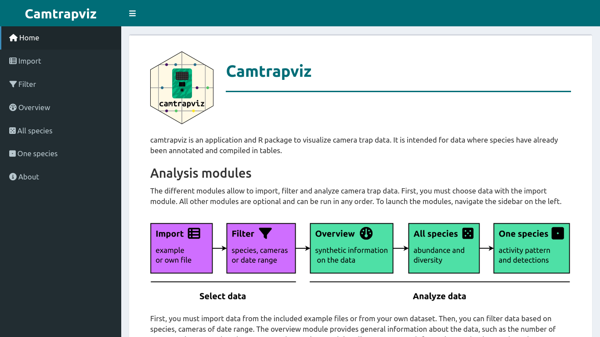

# camtrapviz

<!-- badges: start -->

[](https://CRAN.R-project.org/package=camtrapviz) [](https://lifecycle.r-lib.org/articles/stages.html#experimental) [](https://github.com/LisaNicvert/camtrapviz/actions/workflows/R-CMD-check.yaml)

<!-- badges: end -->

*This package is currently under development*

`camtrapviz` is a R and Shiny package to visualize and summarize camera trap data. It is intended for camera trap data where species have already been tagged and compiled in tables.

The package website can be found at: <https://lisanicvert.github.io/camtrapviz/>.

## Installation

To install the package, use:

``` r
devtools::install_github("https://github.com/LisaNicvert/camtrapviz", 
                         build_vignettes = TRUE)
```

## Functions

### Shiny interface

A Shiny interface run from your computer allows to analyze camera trap data interactively. To run the app, use:

``` r
run_camtrapviz()
```



Two example datasets are provided:

-   [data](https://jniedballa.github.io/camtrapR/reference/recordTableSample.html) and [cameras](https://jniedballa.github.io/camtrapR/reference/camtraps.html) from the camtrapR package

-   a [camtrapDP datapackage](https://inbo.github.io/camtraptor/reference/mica.html) from the camtraptor R package.

You can also choose data to analyze from your computer.


The Shiny app uses [Shinymeta](https://rstudio.github.io/shinymeta/) to display and export the underlying code to the Shiny app.

 

### Data reading and formatting

The package implements functions to read and clean data (see vignettes on [data import and cleaning](https://lisanicvert.github.io/camtrapviz/articles/read-and-clean-data.html) and on [data filtering](https://lisanicvert.github.io/camtrapviz/articles/filter-data.html)).

### Dataviz

There are several functions to visualize data that are illustrated below (using the example dataset from the [camtrapR](https://jniedballa.github.io/camtrapR/) package).

First, you can plot the observations of each camera versus time:


You can also plot the cameras on a map:


It is also possible to plot capture event counts:


You can also plot the activity histogram and curve of the species:


For more details on plots, see the [vignette on plots](https://lisanicvert.github.io/camtrapviz/articles/plots.html) and the [vignette on activity plots](https://lisanicvert.github.io/camtrapviz/articles/activity-patterns.html).

### Data summary and analysis

Other functions allow more specific analyses:

-   summarize species or cameras information (see [vignette](https://lisanicvert.github.io/camtrapviz/articles/summarize.html))
-   get diversity indices at cameras from a species occurrence dataframe with [`get_diversity_indices`](https://lisanicvert.github.io/camtrapviz/reference/get_diversity_indices.html) (vignette will be developed shortly).
